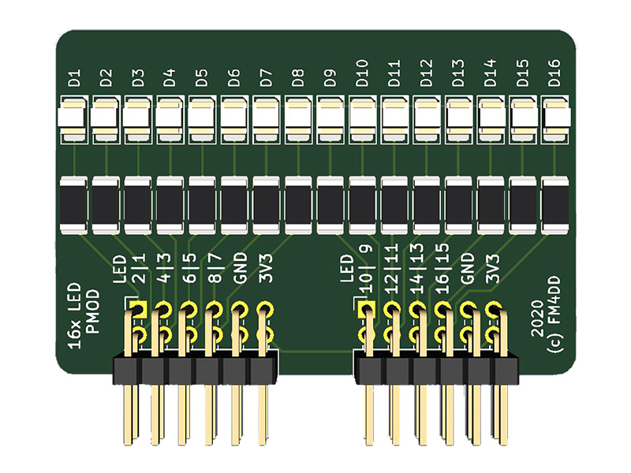
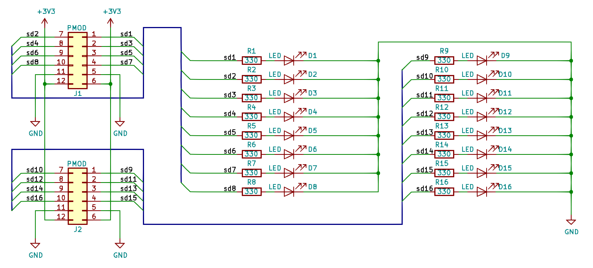

## 16LED PMOD

### Description



This PMOD provides a sixteen LED display output to FPGA designs via two double-row PMODs.
[fpga.fm4dd.com](http://fpga.fm4dd.com)

### Schematic

[](images/16led-schema.png)

### Pin Assignments

#### IceBreaker v1.0

 J1# |  Label | Description   | PMOD1A
-----|--------|---------------|-------
1    |  D1    | LED D1        | 4
7    |  D2    | LED D2        | 3
2    |  D3    | LED D3        | 2
8    |  D4    | LED D4        | 48
3    |  D5    | LED D5        | 47
9    |  D6    | LED D6        | 46
4    |  D7    | LED D7        | 45
10   |  D8    | LED D8        | 44

 J2# |  Label | Description   | PMOD1B
-----|--------|---------------|-------
1    |  D9    | LED D9        | 43
7    |  D10   | LED D10       | 42
2    |  D11   | LED D11       | 38
8    |  D12   | LED D12       | 36
3    |  D13   | LED D13       | 44
9    |  D14   | LED D14       | 32
4    |  D15   | LED D15       | 31
10   |  D16   | LED D16       | 28

#### DE0-Nano-SoC

 J1# |  Label | Description   | GPIO0A | GPIO1A
-----|--------|---------------|--------|--------
1    |  D1    | LED D1        | PIN_W12|PIN_AA15
7    |  D2    | LED D2        | PIN_AF8|PIN_AH27
2    |  D3    | LED D3        | PIN_Y8 |PIN_AG26
8    |  D4    | LED D4        | PIN_AB4|PIN_AH24
3    |  D5    | LED D5        | PIN_W8 |PIN_AF23
9    |  D6    | LED D6        | PIN_Y4 |PIN_AE22
4    |  D7    | LED D7        | PIN_Y5 |PIN_AF21
10   |  D8    | LED D8        | PIN_U11|PIN_AG20

 J2# |  Label | Description   | GPIO0B | GPIO1B
-----|--------|---------------|--------|--------
1    |  D9    | LED D9        | PIN_AF4| PIN_AH23
7    |  D10   | LED D10       | PIN_AF5| PIN_AG23
2    |  D11   | LED D11       | PIN_T13| PIN_AE19
8    |  D12   | LED D12       | PIN_AE7| PIN_AF18
3    |  D13   | LED D13       | PIN_AG6| PIN_AD19
9    |  D14   | LED D14       | PIN_AE4| PIN_AE20
4    |  D15   | LED D15       | PIN_T11| PIN_AE24
10   |  D16   | LED D16       | PIN_AF6| PIN_AD20

### Example Code

#### Verilog

Verilog test program pmod16led_1.v (top-level):
```
// -------------------------------------------------------
// This program is a binary counter displayed on the
// on the pmod D2-8, and 9-16. D1 is pulsing 1Hz clock.
// 12MHz clock: set breakpoint at 23'd5999999
// 50MHz clock: set breakpoint at 25'd24999999
// -------------------------------------------------------
module pmod16led_1 (
  input clk,
  output reg [0:7] pmodled1,
  output reg [0:7] pmodled2,
);

  reg [22:0] count = 23'd0;
  reg clk_1hz = 1'b0;
  assign pmodled1[0] = clk_1hz;

  reg [6:0] lednum1 = 7'd0;
  assign pmodled1[7:1] = lednum1;

  reg [7:0] lednum2 = 8'd0;
  assign pmodled2[7:0] = lednum2;

  always @(posedge clk)
  begin
    count   <= count + 1;
    if(count == 23'd5999999)
    begin
      count   <= 0;
      clk_1hz <= ~clk_1hz;
      lednum1 <= lednum1 + 1;
      lednum2 <= lednum2 + 1;
    end
  end
endmodule
```
